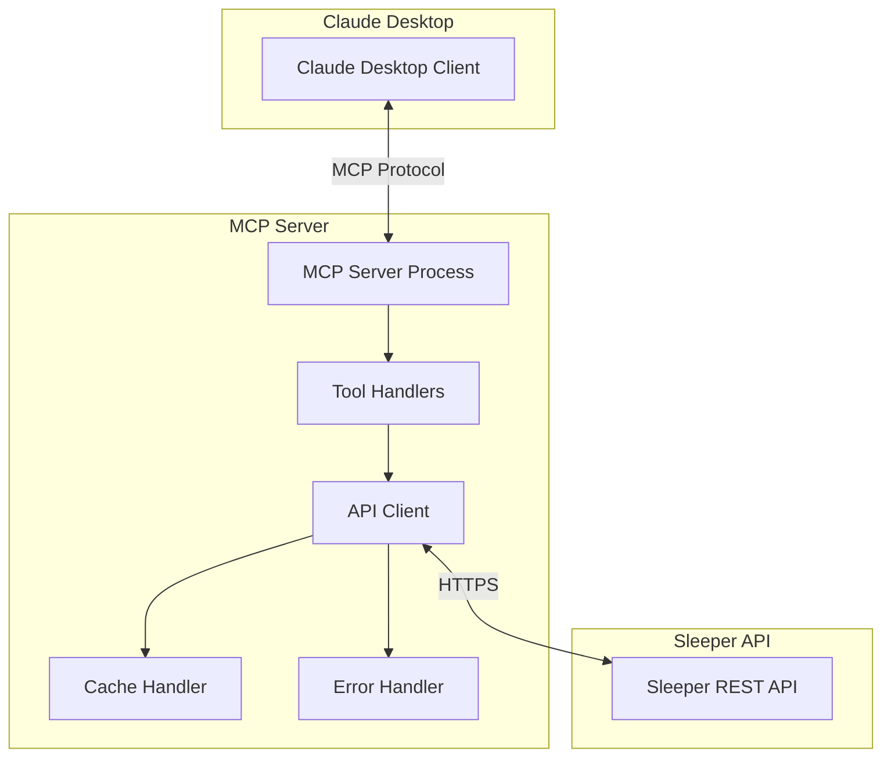

# Design Document

## Overview

The Sleeper MCP Server will be implemented as a Python-based Model Context Protocol server that provides Claude Desktop with access to Sleeper Fantasy Football API data. The server will expose a set of MCP tools that correspond to different Sleeper API endpoints, allowing users to query league information, player data, matchups, and perform trade analysis through natural language interactions.

### Technology Stack Decision

After evaluating multiple options, **Python** is selected as the implementation language for the following reasons:

**Python Advantages:**
- Excellent MCP SDK support with `mcp` package
- Rich ecosystem for HTTP clients (`httpx`, `requests`) and JSON handling
- Strong async/await support for concurrent API calls
- Extensive testing frameworks (`pytest`)
- Easy deployment and dependency management
- Large community and documentation

**Alternative Considerations:**
- **TypeScript/Node.js**: Good MCP support but more complex async handling for API calls
- **Go**: Excellent performance but smaller MCP ecosystem
- **Rust**: High performance but steeper learning curve and less MCP tooling

## Architecture



The server follows a layered architecture:
1. **MCP Protocol Layer**: Handles communication with Claude Desktop
2. **Tool Handler Layer**: Processes tool calls and orchestrates API requests
3. **API Client Layer**: Manages HTTP requests to Sleeper API with rate limiting
4. **Caching Layer**: Reduces API calls for frequently requested data
5. **Error Handling Layer**: Provides robust error management and user-friendly messages

## Components and Interfaces

### Core Components

#### 1. MCP Server (`sleeper_mcp_server.py`)
- Main entry point implementing MCP server protocol
- Registers all available tools with Claude Desktop
- Handles tool execution requests and returns formatted responses

#### 2. Sleeper API Client (`sleeper_client.py`)
- Manages all HTTP requests to Sleeper API endpoints
- Implements rate limiting and retry logic
- Handles authentication (if required in future)
- Provides typed response models

#### 3. Tool Handlers (`tools/`)
- `league_tools.py`: League information, rosters, settings
- `player_tools.py`: Player search, stats, projections, trending
- `matchup_tools.py`: Matchup data, scores, historical results
- `trade_tools.py`: Trade analysis and roster evaluation

#### 4. Data Models (`models.py`)
- Pydantic models for Sleeper API responses
- Type-safe data structures for internal processing
- Validation and serialization logic

#### 5. Cache Manager (`cache.py`)
- In-memory caching for frequently accessed data
- TTL-based expiration for different data types
- Cache invalidation strategies

### MCP Tools Interface

The server will expose the following tools to Claude Desktop:

```python
# League Tools
get_user_leagues(username: str) -> List[League]
get_league_info(league_id: str) -> League
get_league_rosters(league_id: str) -> List[Roster]
get_league_users(league_id: str) -> List[User]

# Player Tools  
search_players(query: str, position: Optional[str]) -> List[Player]
get_trending_players(sport: str, add_drop: str) -> List[TrendingPlayer]
get_player_stats(player_id: str, season: str) -> PlayerStats

# Matchup Tools
get_matchups(league_id: str, week: int) -> List[Matchup]
get_matchup_scores(league_id: str, week: int) -> List[MatchupScore]

# Trade Tools
analyze_trade_targets(league_id: str, roster_id: str, position: str) -> TradeAnalysis
evaluate_roster_needs(league_id: str, roster_id: str) -> RosterAnalysis
```

## Data Models

### Core Data Structures

```python
@dataclass
class League:
    league_id: str
    name: str
    season: str
    status: str
    settings: LeagueSettings
    scoring_settings: Dict[str, float]
    roster_positions: List[str]

@dataclass  
class Player:
    player_id: str
    full_name: str
    position: str
    team: str
    status: str
    stats: Optional[Dict[str, Any]]

@dataclass
class Matchup:
    matchup_id: int
    roster_id: int
    points: float
    players: List[str]
    starters: List[str]

@dataclass
class TradeAnalysis:
    target_teams: List[str]
    suggested_trades: List[TradeProposal]
    positional_needs: Dict[str, int]
    trade_value_analysis: Dict[str, float]
```

### API Response Caching Strategy

- **Player Data**: 1 hour TTL (relatively static)
- **League Settings**: 24 hours TTL (rarely change mid-season)  
- **Matchup Data**: 5 minutes TTL during games, 1 hour otherwise
- **Trending Players**: 30 minutes TTL
- **Roster Data**: 15 minutes TTL

## Error Handling

### Error Categories and Responses

1. **API Rate Limiting**
   - Implement exponential backoff (1s, 2s, 4s, 8s)
   - Queue requests during rate limit periods
   - Return user-friendly "please wait" messages

2. **Invalid Input Errors**
   - Validate league IDs, usernames, player names
   - Provide suggestions for common typos
   - Clear error messages with examples

3. **Network/API Errors**
   - Retry transient failures (5xx errors)
   - Graceful degradation when API is unavailable
   - Cached data fallback when possible

4. **Data Processing Errors**
   - Handle malformed API responses
   - Validate data structure before processing
   - Log errors for debugging while returning safe messages

### Error Response Format

```python
@dataclass
class ErrorResponse:
    error_type: str
    message: str
    suggestions: Optional[List[str]]
    retry_after: Optional[int]
```

## Testing Strategy

### Unit Testing
- Test each tool handler independently
- Mock Sleeper API responses for consistent testing
- Validate data model serialization/deserialization
- Test error handling scenarios

### Integration Testing  
- Test MCP protocol communication
- Validate end-to-end tool execution
- Test rate limiting and retry logic
- Cache behavior verification

### Performance Testing
- API response time benchmarks
- Memory usage monitoring
- Concurrent request handling
- Cache hit rate optimization

### Test Data Management
- Use realistic Sleeper API response fixtures
- Test with various league configurations
- Edge cases: empty leagues, inactive players, etc.

## Deployment Configuration

### MCP Configuration for Claude Desktop

The server will be configured in Claude Desktop's MCP settings as follows:

```json
{
  "mcpServers": {
    "sleeper": {
      "command": "python",
      "args": ["-m", "sleeper_mcp_server"],
      "env": {
        "SLEEPER_API_BASE_URL": "https://api.sleeper.app/v1",
        "CACHE_TTL_SECONDS": "3600",
        "LOG_LEVEL": "INFO"
      },
      "disabled": false,
      "autoApprove": [
        "get_user_leagues",
        "get_league_info", 
        "search_players",
        "get_trending_players"
      ]
    }
  }
}
```

### Environment Variables
- `SLEEPER_API_BASE_URL`: Sleeper API endpoint (default: https://api.sleeper.app/v1)
- `CACHE_TTL_SECONDS`: Default cache TTL (default: 3600)
- `LOG_LEVEL`: Logging verbosity (default: INFO)
- `MAX_RETRIES`: Maximum API retry attempts (default: 3)

### Package Structure
```
sleeper-mcp-server/
├── sleeper_mcp_server/
│   ├── __init__.py
│   ├── __main__.py
│   ├── server.py
│   ├── sleeper_client.py
│   ├── models.py
│   ├── cache.py
│   ├── tools/
│   │   ├── __init__.py
│   │   ├── league_tools.py
│   │   ├── player_tools.py
│   │   ├── matchup_tools.py
│   │   └── trade_tools.py
│   └── utils/
│       ├── __init__.py
│       └── logging.py
├── tests/
├── requirements.txt
├── pyproject.toml
└── README.md
```